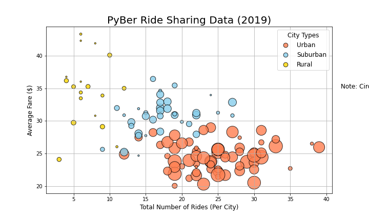
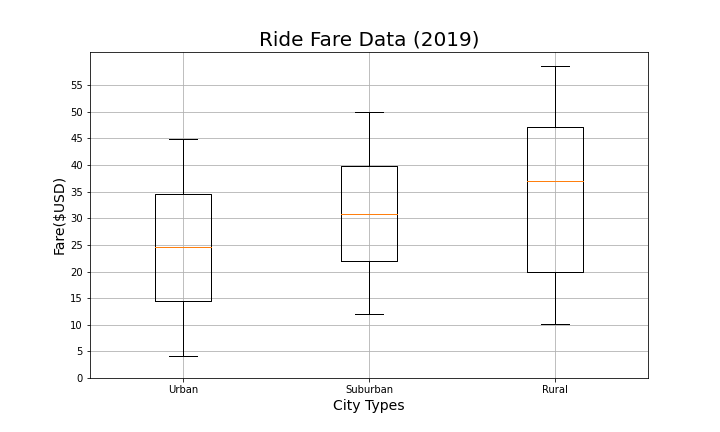
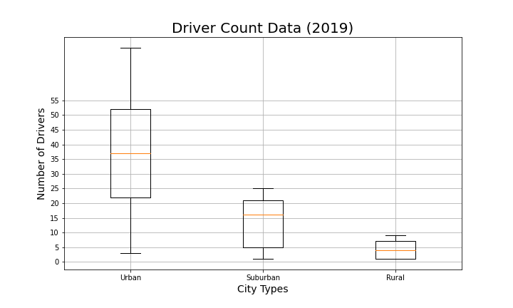
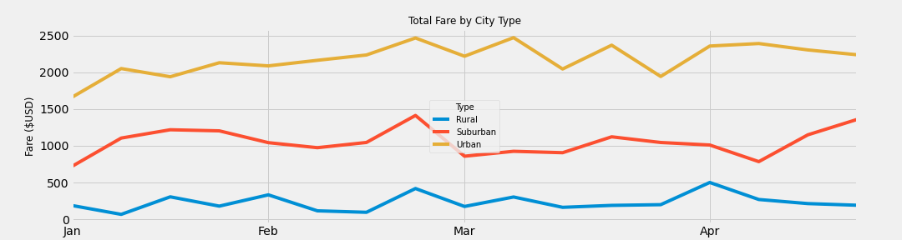

# PyBer_Analysis
### Overview of the analysis
    The purpose of the PyBer Ride Data Analysis was to help V. Isualize and Omar create data visualizations using Matplotlib and Pandas.
    We created bubble charts to help visualize the data by city type, we created box-and-whisker plot charts to show any outliers of the PyBer Ride Data, we created pie charts to display the percentages of Fares, Rides, and Drivers by city type, lastly we created a line chart to show the weekly fares in $USD by week and by city type.
### Results

### 
### 
### 
### 
### 
### 
### 
### 
### Summary: Based on the results, provide three business recommendations to the CEO for addressing any disparities among the city types.
    Based on the results, it's obvious that drivers in Urban areas are in higher demand than those of Suburban or Rural areas. Fare prices are higher in rural areas which can help compensate for the low demand. The data makes sense that Urban fares are higher in total by city type due to the higher demand of rides and the availability of drivers.

### CEO Recommendations
    My recommendations to the CEO would be to randomize work or atleast create an option for the drivers to select the type of rides they would like to drive. If the work was more randomized I think it would help average out the total fares by city type.

    This is a service business and to be realistic PyBer is providing a service to where it is needed. So there really isn't much we can do to increase the demand of rides in Rural areas. 

    I would suggest to consider other data of these rides if you really want to create some kind of new way to provide more service to the least in demand cities. Perhaps night life or time of day, tourism, or other variables that can give a better understanding of the "Why" questions. From there, we can figure the "How".

## Technologies Used
    * Python 3
    * Jupyter Notebook
    * Pandas
    * Matplotlib
    * VS Code
    * zsh terminal
    * Git
    * Github